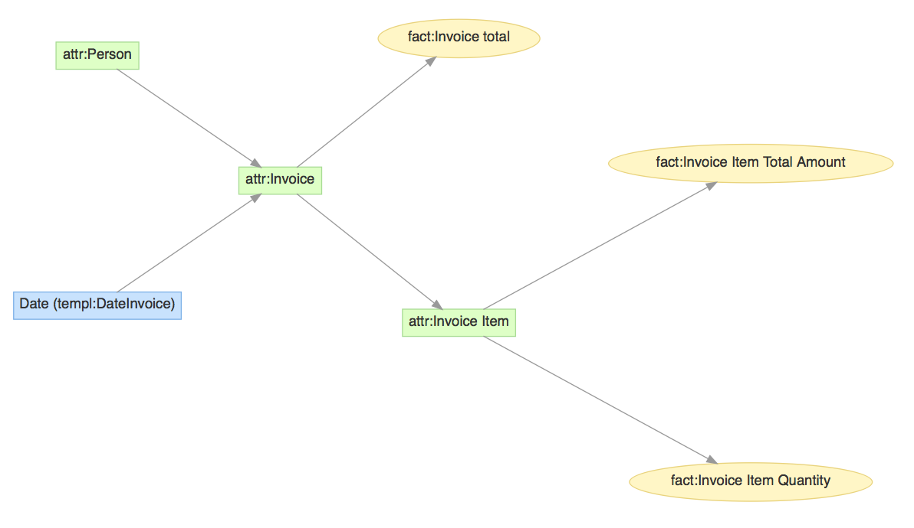

SingleInvoice
---
Simple fixture with one dataset, copied over from 
[mcermak](https://github.com/mcermak/mce-gdc-test-projects/tree/master/projects/single_invoice).

Model
---


Default data
---
Fixture version [1](1) contains the data for 15 people and invoices for years 2016-2019.

Custom data
---
Use [generate_csv](generate_csv) to generate custom data for your SingleInvoice project.
```
usage: generate_csv [-h] [--invoices INVOICES] [--persons PERSONS]
                    [--prng-seed PRNG_SEED] [--weekends]
                    start_year end_year

Generate random data for SingleInvoice project

positional arguments:
  start_year            First year of your invoice data
  end_year              Last year of your invoice data

optional arguments:
  -h, --help            show this help message and exit
  --invoices INVOICES, -i INVOICES
                        Number of invoices per year (default is 260).
  --persons PERSONS, -p PERSONS
                        Number of persons. By default, enough to have about 3
                        invoices per each person.
  --prng-seed PRNG_SEED, -s PRNG_SEED
                        Initialize internal state of the pseudo-random number
                        generator to a known state.
  --weekends, -w        Include weekend days. Default is not to include.
```

Sample output:
```
$ generate_csv -s 1 -i 4 -p 3 2016 2016
"tab_inv_item.col_quantity","tab_inv_item.col_total","tab_inv.col_total","tab_inv.col_name","tab_inv.dt_invoice","tab_pers.col_bn","tab_pers.col_fn","tab_pers.col_sn","tab_pers.col_hn"
7,24,5,inv-0000000000000000000000000001,2016-01-12,2,"Ina","Millican","Ina Millican"
5,23,1,inv-0000000000000000000000000002,2016-06-13,2,"Ina","Millican","Ina Millican"
3,29,46,inv-0000000000000000000000000003,2016-01-12,0,"Burrell","Kellam","Burrell Kellam"
6,29,20,inv-0000000000000000000000000004,2016-03-21,1,"Rockley","Reiff","Rockley Reiff"
```
